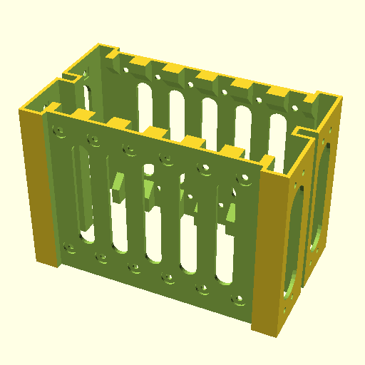
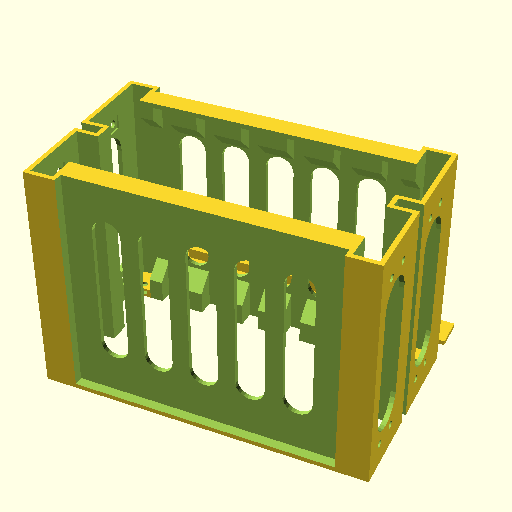
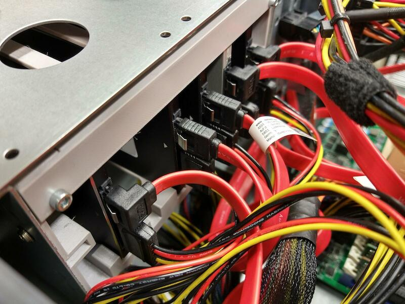

# Adapter for multiple 2.5" drives in two 5.25 slots

Published also at Thingiverse: https://www.thingiverse.com/thing:4735207

This is an adapter that allows installing 6 or more (customizable) small 2.5" storage drives into the space of two adjacent 5.25 drive slots. This can be useful with older computer cases that don't have many small drive slots.

Two variants are included:

- Regular variant ([STL file](adapter.stl)): drives can be fitted into the adapter with screws. This is recommended if you want to use this adapter with HDD drives, because these cause vibration and would rattle in the "semi toolless" variant.

  

- "Semi toolless" variant ([STL file](adapter-semi-toolless.stl)): all drives are secured with a bracket that is kept in place with two M3 screws (that screw into two M3 square nuts that you place in the nut traps). This allows adding and removing drives without removing the adapter from the computer case, if there's enough room to maneuver around it. This is not completely toolless, so I call this variant "semi toolless". Hex screws are recoommended, because there are hex screw drivers available that can work at a slight angle, which can make access easier while the adapter is in the computer case. This version is recommended for SSD drives only.

  

Both variants require adding at least 4 square M3 nuts to be carefully glued, centered, into 4 square recesses around the holes at the sides where the adapter gets fitted into the 5.25 slots. Two attachment points at least on each side. Cyanocrilate based glue works for me.

Print in a material with higher temperature resistance, such as PETG or better. I recommend against printing in PLA because it gets soft at 55-60°C. Temperatures inside computer case may reach that levels, causing adapter to deform. Recommended to print with 3 perimeters.

A semi toolless variant as installed in a server case, relieving the shortage of 2.5" slots:

Shield: [![CC BY 4.0][cc-by-shield]][cc-by]

This work is licensed under a
[Creative Commons Attribution 4.0 International License][cc-by].

[![CC BY 4.0][cc-by-image]][cc-by]

[cc-by]: http://creativecommons.org/licenses/by/4.0/
[cc-by-image]: https://i.creativecommons.org/l/by/4.0/88x31.png
[cc-by-shield]: https://img.shields.io/badge/License-CC%20BY%204.0-lightgrey.svg